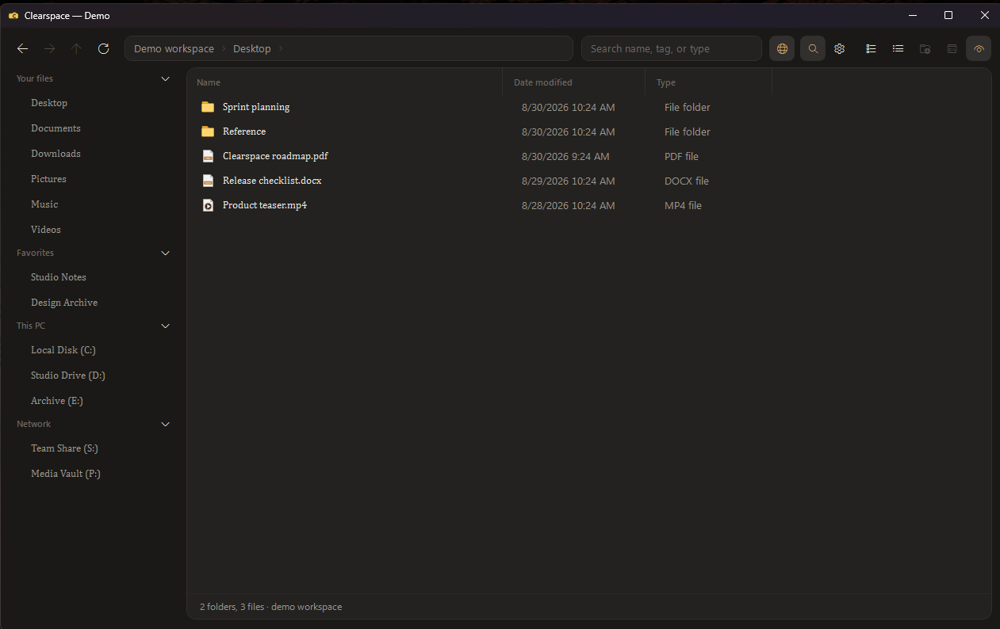

# Clearspace

Clearspace is a modern Windows file manager built to be a comfortable replacement for File Explorer: familiar file operations, a calmer interface, and better ways to organize and find work.

> **Work in progress:** Clearspace 1.0.0 is an early public release. There will be bugs and rough edges as it is used on more Windows setups and file collections. Please report issues you find; fixes and improvements will continue over time.



> The screenshot uses Clearspace Demo Mode. Every folder and file shown is fictional.

## What Clearspace adds

### Folder types that adapt to your work

Any folder can be given a type such as **General**, **Documents**, **Downloads**, **Photos**, **Music**, or **Videos**. The type is saved for that location and changes the view to suit the content:

- Photos and Videos open naturally in a visual grid.
- Music uses a music-focused list with artist, album, track, and length columns.
- Documents, Downloads, Desktop, and General folders keep an efficient details view.
- Typed folders receive a matching visual badge, so the sidebar and grids are easier to scan.

Select several folders, right-click, and set their type together when organizing a larger collection.

### Built-in music player

Set a directory to **Music** and Clearspace can play supported tracks directly in the app. It reads the same Windows music properties used by Explorer for metadata such as artist, album, track number, and duration, while keeping ordinary double-click behavior available for opening files in their default app.

### Tags and Favorites

Tags are lightweight labels you can create and apply to one or many selected files and folders. They make it possible to group work across unrelated locations without moving anything on disk.

- Create, apply, remove, and delete tags from the right-click menu.
- Search by a tag name, or use `tag:work` for an exact tag filter.
- Pin frequently used locations to Favorites in the sidebar.
- Organize pinned locations into your own collapsible, reorderable categories.

### Photo viewer and editing

The Photos folder type has an in-app image viewer. Open an image from its tile to browse the folder, zoom, and pan without leaving Clearspace. You can also rotate an image or crop a selected region directly in the viewer, saving in place when the format supports it or saving a copy when needed.

### Search designed to stay responsive

Clearspace treats search as a layered operation instead of making the interface wait for a complete disk walk:

1. Filtering the folder already on screen happens immediately from its in-memory snapshot.
2. Search then walks subfolders in the background and streams additional matches into the results rather than freezing the window.
3. When enabled, Clearspace also asks the existing **Windows Search index** for fast results from indexed locations—including supported text inside documents—while the background walk continues to cover locations Windows has not indexed.

The result is a faster first response, plus complete results rather than a choice between speed and coverage. **Search Everywhere** expands the search to ready local drives and Clearspace's saved tag/folder-type indexes. Network drives are intentionally not crawled as part of that wide search, because an unavailable share should not make search feel stalled.

Useful search filters:

```text
tag:work           items with the Work tag
type:photos        folders set to the Photos type
ext:png            PNG files
is:folder          folders only
is:image           image files only
```

Clearspace uses the Windows-maintained index; it does not create a second private index of your files. Content results depend on Windows indexing the location and having an IFilter for that file type. If the service is off or a location is not indexed, Clearspace falls back gracefully to its background crawl.

## Familiar file-manager foundations

- Browse local, mapped network, and known Windows folders.
- Back, forward, up, breadcrumb navigation, side-mouse navigation, and an address bar.
- Copy, cut, paste, rename, new folder, delete to the Recycle Bin, and properties.
- Explorer-style right-click menus and Windows copy/conflict dialogs.
- This PC and Network hubs with drive capacity indicators.
- Per-folder details-column order and width, saved between sessions.
- Grid zoom is remembered independently for each folder.
- Optional terminal launch in the folder currently being viewed.

## Install or build

### Installable release

Run [Build Installer.cmd](Build%20Installer.cmd). It publishes a self-contained 64-bit build, then creates:

```text
release\ClearspaceSetup.exe
```

The setup is a normal one-click Windows installer. It installs Clearspace for the current user, includes the required .NET runtime, creates a Start Menu entry, and offers an optional desktop shortcut. Building the next version with the same installer updates the existing installation in place.

Building the installer requires the [.NET 10 SDK](https://dotnet.microsoft.com/download/dotnet/10.0) and [Inno Setup 6](https://jrsoftware.org/isdl.php). End users only need the generated setup file.

### Development build

Run [Build Clearspace.cmd](Build%20Clearspace.cmd) to publish a local executable to `dist\` and create a desktop shortcut. [Run Clearspace.cmd](Run%20Clearspace.cmd) is the rebuild-and-launch option for development.

## Demo Mode

Use [Run Demo.cmd](Run%20Demo.cmd) to launch a screenshot-safe fictional workspace. It never enumerates your personal files, drives, cloud folders, thumbnails, or Windows search index. The bundled sample images are safe to use when demonstrating the grid and photo viewer.

For any compiled build, Demo Mode can also be launched with:

```text
Clearspace.exe --demo
```

## Project layout

```text
Clearspace/      WPF application source
docs/images/     README screenshots
installer/       Inno Setup installer definition
tools/           Small local build tools
dist/            Local published build (generated)
release/         Installer output (generated)
_archive/        Superseded prototypes kept for reference
```

For architecture and implementation notes, see [Clearspace/ARCHITECTURE.md](Clearspace/ARCHITECTURE.md).
